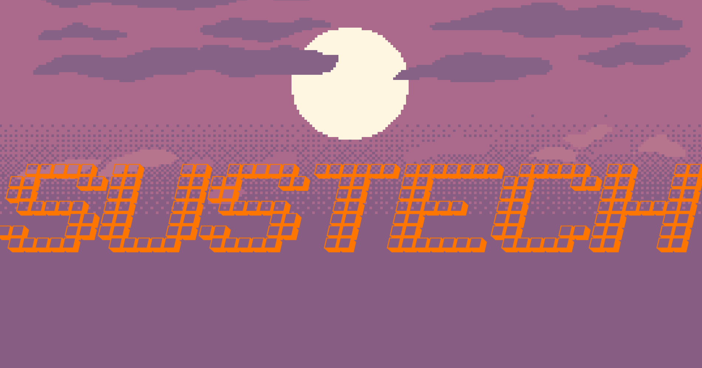

# Nothing WarChess - 「没有什么华盖战旗」

## 游戏展示

- 主界面

  

- 载入游戏界面

  

- 游戏内战斗

  

## Time line

| 时间    | 事件                                       |
| ------- | ------------------------------------------ |
| Week 1  | unity + c#学习<br />战棋规则学习           |
| Week 2  | unity + c#学习<br />战棋规则学习           |
| Week 3  | 地图、场景搭建                             |
| Week 4  | 基础的人物对象模型设计，寻路、移动范围算法 |
| Week 5  | UI、总控的完善                             |
| Week 6  | 第一个战斗demo 游戏的完整流转              |
| Week 7  | 添加道具、装备系统                         |
| Week 8  | 场景、地图的丰富                           |
| Week 9  | 小剧情的加入                               |
| Week 10 | 存档功能                                   |
| Week 11 | dlc的添加                                  |
| Week 12 | 继续完善 准备答辩                          |


## Coding style

详细微软官方代码风格文档: [C# 编码约定 | Microsoft Docs](https://docs.microsoft.com/zh-cn/dotnet/csharp/fundamentals/coding-style/coding-conventions)

- 大括号需要换行。其中`if-else`中每个条件分支的大括号应另起一行，如下：

  ```c#
  class Demo
  {
      static void Main(string[] args)
      {
          if (/**/)
          {
              //...
          }
          else if (/**/)
          {
              //...
          }
          else
          {
              //...
          }
      }
  }
  ```

- 命名规范：

  | 命名对象              | 规则                          |
  | --------------------- | ----------------------------- |
  | 类名                  | 大驼峰规则 `DataService`      |
  | interface 命名        | I + 大驼峰 `IController`      |
  | public 成员           | 大驼峰 `public bool IsValid;` |
  | private internal 字段 | _ + 小驼峰 `_camelCasing`     |
  | 普通成员              | 小驼峰 `camelCasing`          |

- 禁止使用`var`和`dynamic`变量类型

## Git commit style

| type         | commit    |
| ------------ | --------- |
| 新功能       | feat:     |
| 修复bug      | fix:      |
| 代码重构     | refactor: |
| 文档修改     | docs:     |
| 代码格式修改 | style:    |
| 测试用例修改 | test:     |
| 其他优化     | chore:    |


## Features

### Basic

- [x] 完整的游戏结构：游戏主界面，游戏内界面等。

- 至少实现两种游戏模式：

  - [x] 单人模式（人机对战）: 人机对战的 AI 需要有一定的行为逻辑，不能设置为简单的随机。设计至少两个关卡。
  - [x] 本地多人对战模式：玩家可以在同一台设备上交替对战。

- [x] 设计至少三种棋子职业/兵种，每个兵种至少包含三种属性（如攻击，防御，血量等）。不 同兵种需要有除基础属性外的明显区分。

  |          | Hp   | Atk  | Def  | Mv   | AtkRange |
  | -------- | ---- | ---- | ---- | ---- | -------- |
  | Archer   | 24   | 15   | 4    | 4    | 2        |
  | Assassin | 20   | 20   | 4    | 5    | 1        |
  | Brawler  | 30   | 17   | 5    | 5    | 1        |
  | Knight   | 30   | 17   | 5    | 4    | 1        |
  | Monk     | 28   | 15   | 5    | 4    | 1        |
  | Wizard   | 24   | 18   | 4    | 4    | 1        |

- 简易的地形要素，至少包括：

  - [x] 有可移动和不可移动的地形区分。
  - [x] 可以自定义地图，通过文件的形式读取。存储格式不限。

- 简易的 rpg 元素，至少包括：

  - [x] 棋子可以提升等级，携带装备/学习技能/使用道具（至少实现其中一个）。
    升级： 属性动态变化 使用升级公式

    | hp血               | mv移动力                   | def防   | attack攻                |
    | ------------------ | -------------------------- | ------- | ----------------------- |
    | base+round(lv*3.5) | min(base+floor(lv/10), 10) | base+lv | base+lv*2+floor(lv/5)*5 |

    携带装备：经验药、血瓶、魔法瓶 各3瓶

  - [x] 至少设计 2 种不同功能的技能/道具/装备。
    技能，一共6总不同技能，具有提升攻击范围，播放特效，提升攻击力等属性的作用

- 基本的 UI 交互，至少包括：

  - [x] 选中棋子时显示能移动的范围。
  - [x] 棋子选中与行动完毕后的不同显示效果。
  - [x] 在周围有多个敌人的时候可以选择战斗的对象。

- 完备的游戏逻辑，至少包括：

  - [x] 双方棋子对战时，合理且正确的攻击顺序及伤害计算，要求显示出简易的过程。
  - [x] 在特定的情况或一方棋子全灭的时候，正确判断游戏胜负。
  - [x] 正常状态下，棋子每一回合最多只能移动一次，攻击/技能一次或使用一次道具。
  - [x] 敌我双方正常的回合交互。要求所有我方棋子行动后结束自己的回合或手动提前结束回合。（玩家回合/棋子回合，两种模式都可以）

### Advanced

- [x] 实现悔棋任意步数的功能。
- [x] 设计单人模式的游戏存读档功能界面，需要至少设计三个或以上的固定档位。存档可以覆 盖、销毁，在读档界面显示游戏的保存时间。
- [x] 设计为 3d 视角的战旗游戏，可以实现视角的移动、旋转。
- 更丰富的可以影响战斗的地形元素：
  - [x] 地形有高度，位于高处的人攻击位于低处的人，伤害会增加
  - [x] 有多种方块会给附近玩家加buff
    - 金块：下回合内增加移动力
    - 信标：3格范围内攻击+1
    - 高草堆：增加防御力
- [x] 更《精美》的游戏界面，人物模型设计以及流畅的 UI 交互


## 注意事项

- Unity编辑器版本为`2021.3.5f1c1`
- 游戏只支持1080p（
- `game-scene`文件夹里是预制的游戏地图文件，不要删除（
- 存档在`save`里

